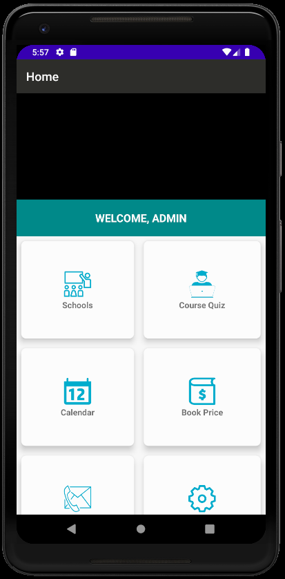
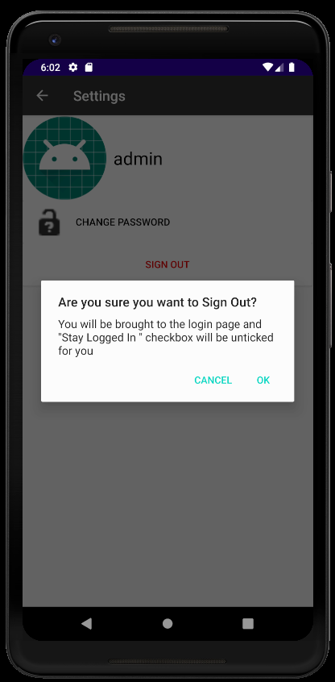

# MAD-Team2-Assignment
## Team members' names, Student IDs 
1)Goh Qi Xun, S10192811B 
2)Yip Jun Wei, S10198567B 
3)Kamarul Aszryn Bin Jalil, s10198273F 
4)Tan Guan Teck, S10198165K 

## Problem Statement

Have you ever struggled on deciding what career path to pursue in the future? Have you ever been indecisive about what course to select?

## Description of app

“Learning@NP” app is an excellent way for graduating students who are deciding what course they want to join in Ngee Ann Polytechnic. Our app provides many functions including a survey to give the students a better insight or clearer view of what path they want to choose. Our app also allows students to learn more about Ngee Ann Polytechnic with functions ranging from “Book Prices” to “Academic Calendar”.

In the future we plan to implement a GPS to navigate new students through Ngee Ann Polytechnic.
## Target Audience 
Our target audience is graduating Secondary School students and ITE students planning to join Ngee Ann Polytechnic. 

## Basic features of our app 
-Our app is responsive, allows the app to orientate and use for different sizes of phone 
-Has a recycler view  
-Includes SQLite and sharedpreferences  
-Has multimedia  

## Roles and contributions of each member 

**Jun Wei :** 

LoginPage 
- 
Homepage  
- 
SignUp 
- 
Settings 
- 
ChangePassword 
- 
CourseSuits 
- 

**Qi Xun :** 

CourseSuits 
- 
School 
- 
Courses 
- 
Contact 
- 
GeneralContact 
- 
AcademicContact 
- 
Design for BookPrice 
- 

**Guan Teck :**  

AcademicCalendar layout 
-Designed using linearlayout and scrollview 
-Implemented countdown function

GeneralContact layout 
-Helped in keying more additional information

CourseSuits layout 
-Designed 1st draft for this layout

Homepage video 
-Implemented video in homepage

Research on Quiz questions 
-Done some research for quiz questions. 

Updated readme 

**Kamarul :** 

BookPrice 
-Used RecyclerView 
-Programmed BookActivity,BookAdapter,BookModel,BookViewHolder 

AcademicContact 
-Help key in more contact information 

Help in design of LoginPage 

Research on Quiz questions 
-Help research on questions for quiz 

Updated readme 

## Relevant appendices (diagrams, screenshots, user guides) 

Discussion on Health/Fitness App 
 
 

Decided to change idea from Health/Fitness app to Education app 

**User Guide for our app** 

LoginPage 
User inputs their username and password and presses the ‘LOGIN’ button to log in. They can click "Remember Me" to remember their credentials and "Stay Logged In" if they do not want to type out their username and password to login. For new users, they can click the "New user? Sign up here" to sign up. 

SignUpPage 

HomePage 
In the homepage, above the text "WELCOME,ADMIN" there will be a video playing. This page is in cardview and users can click on the respective cardviews to go to the page stated in the text. 

SchoolsPage 
This page is a RecyclerView and shows all the schools in Ngee Ann Poly for users to see. Users can click on the respective images to see available courses in that school. 

CoursesPage 
This page is a RecyclerView and shows all the available courses for the respective schools in Ngee Ann Poly for users to see. 

CourseQuizPage 
This page uses a linear layout with scrollview and displays the image and instructions for the quiz. Users can click the “Start Quiz button” to start the quiz. 

QuizPage 

AcademicCalenderPage 
This page uses a linear layout with scrollview to display the academic calendar for the current year. It also implements a countdown function for days until the next holiday. 

BookPricesPage 
This page is a RecyclerView that displays some books that are shared between courses in the same school for users to see the price. 

ContactPage 
This page uses a linear layout with scrollview to display the address and opening hours of the campus. It also uses a cardview with relative layout where users can click on the card to go to ‘General Contact’, ‘Academic Contact’ pages. For the ‘QUALITY SERVICE FEEDBACK’, users will be asked to  choose their preferred web browser, and will be directed to a webpage where they can give feedback/comments on the service. 

GeneralContactPage 
This page is a RecyclerView that displays general contacts from Ngee Ann Poly. Users can call the number or mail the email for any enquiries. 

AcademicContactPage 
This page is a RecyclerView that displays academic contacts from Ngee Ann Poly. Users can refer to the telephone and email to contact the respective people. 

SettingsPage 
Users can come here to change their password and to sign out from the current account they are logged in to. 

ChangePasswordPage 
