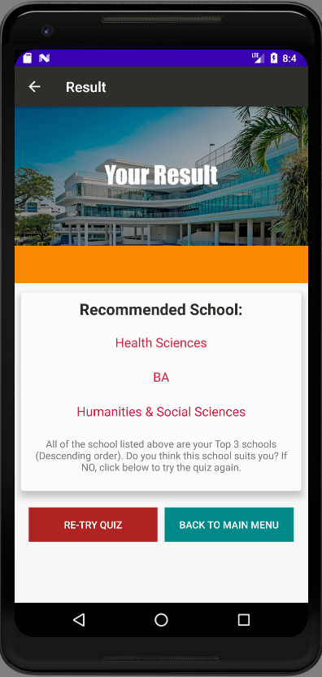

# MAD-Team2-Assignment
## Team members' names, Student IDs 
1)Goh Qi Xun, S10192811B 
2)Yip Jun Wei, S10198567B 
3)Kamarul Aszryn Bin Jalil, S10198273F 
4)Tan Guan Teck, S10198165K 

## Problem Statement

Have you ever struggled on deciding what career path to pursue in the future? Have you ever been indecisive about what course to select?

## Description of app

“Learning@NP” app is an excellent way for graduating students who are deciding what course they want to join in Ngee Ann Polytechnic. Our app provides many functions including a survey to give the students a better insight or clearer view of what path they want to choose. Our app also allows students to learn more about Ngee Ann Polytechnic with functions ranging from “Book Prices” to “Academic Calendar”.

Some of the features we hope to implement in the future: 

- Implement a GPS to navigate visitors/new students. 
- More In-depth information about each course. 
- Allow students to purchase textbooks. 
- Use online cloud storage (Firebase) to store information. 
- Search Bar to allow users to search for specific courses and textbooks. 
- Side menu for more navigation around the app. 
- Create an admin user that allows them to add textbook, courses, other information, etc. 

## Target Audience 
Our target audience is graduating Secondary School students and ITE students planning to join Ngee Ann Polytechnic.Freshies that are new to the school. 

## Basic features of our app 
-Our app is responsive, allows the app to orientate and use for different sizes of phone 
-Has a recycler view  
-Includes SQLite and sharedpreferences  
-Has multimedia  

## Things that have been implemented 
- GPS 
- Admin to allow them to add textbook, courses, other information, etc. 
- Used online cloud storage (Firebase) to store information. 

## Roles and contributions of each member 

**Jun Wei :** 

AndroidManifest 
-Programmed the actionbar so that there will be a back button to navigate to parent class 

LoginPage 
-Used SQLite and sharedPreference 
-Programmed LoginActivity,MyDBHandler,UserData 
-Used Event handling(Toast) 
-Used responsive(OnFocus) 

Homepage  
-Programmed the Cardview Design  
-Programmed and Design the Floating Action button 

SignUp 
-Used SQLite and sharedPreference 
-Programmed SignUpActivity 

Settings 
-Used Linear View 
-User SharedPreference 
-Used Event Handling(Alert) 
-Programmed SettingsActivity,ChangePassword Activity 

ChangePassword 
-Used SQLite and sharedPreference 
-Programmed ChangePasswordActivity 
-Used responsive(OnFocus) 

CourseSuits/Quiz 
-Programmed StartQuizActivity 
-Used Intent to passdata(array) 

Result 
-Programmed ResultActivity 
-Used Intent to received data(array) 

GPS 
-Programmed GPSActivity 
-Used Map SDK for android and directions API 
-Used Polyline to map out the route 
-Used OnLocationChanged and Looper to constantly get user's current location 
-Used try catch for error handling 
-Used Floating Action button for better UI  
-Used fragment to overlay two layouts together 

Design 
- Designed the app logo 
- Admin main page banner 
- appstore app preview banner 

**Qi Xun :** 

Homepage 
-Design the layout of the page 

CourseSuits/Quiz 
-Design the instruction page 

School 
-Program and design the activity 
-Used RecyclerView 
-Created Model for the schools 
-Used CardView for each RecyclerView row 

Courses 
-Used RecyclerView 
-Created Model for courses 
-Used CardView for each RecyclerView row 

StartQuiz 
-Created Model for the quiz to store data in list 
-Override “Collections.sort” method in Model for sorting 

BookPrice 
-Designed the layout and the row 

ContactUs 
-Designed the layout 

GeneralContact 
-Designed the layout for each row 
-Created Model 

AcademicContact 
-Designed the layout for each row 
-Created Model 

LoginPage 
-Updated design for Login Page 
-Programmed Forget password 

Others 
-Added scroll view in most layouts for responsiveness. 
-Converting Constraint to Linear layout for responsiveness 

Admin 
-Designed Admin page  
-Programmed Admin add courses  

-Live Chat  
-Programmed Live Chat for Admin and User 

Create Account 
-Programmed create account  
-Changed SQLite to Firebase   

Splash Screen  
-Programmed Splash Screen   
-Design Splash Screen  

User Info   
-Programmed and design User Info Paged

**Kamarul :** 

BookPrice 
-Used RecyclerView 
-Programmed BookActivity,BookAdapter,BookModel,BookViewHolder 

AcademicContact 
-Help key in more contact information 
-Created RecyclerView 

Help in design of LoginPage 

Research on Quiz questions 
-Help research on questions for quiz 

Result 
-Design for Result Page 

Updated Documentation 

Admin 
-Programmed AddBookActivity 
-Designed AddBookActivity 

**Guan Teck :**  

AcademicCalendar layout 
-Designed using relativelayout and scrollview 
-Programmed AcademicCalendar

GeneralContact layout 
-Helped in keying more additional information 
-Created RecyclerView

CourseSuits/Quiz layout 
-Designed 1st draft for this layout

Homepage video 
-Programmed to mute video 
-Programmed video in homepage

Research on Quiz questions 
-Done some research for quiz questions. 

Updated Documentation 

Designed icons 

AutoLogin 
-Programmed application to autologin
-Programmed admin role to admin page, user role to user page 

Login 
-Programmed LoginPage 
-Changed SQLite to Firebase 
-Used sharedpreference for Remember Me checkbox 
-Programmed admin role to admin page, user role to user page 

Change Password 
-Programmed ChangePassword 
-Changed SQLite to Firebase 
-Used sharedpreference for Current Password 

Sign out 
-Programmed Sign out 
-Changed SQLite to Firebase 

## Relevant appendices (diagrams, screenshots, user guides) 

Discussion on Health/Fitness App 
 
 

Decided to change idea from Health/Fitness app to Education app 

## User Guide for our app 

LoginPage 
User inputs their username and password and presses the ‘LOGIN’ button to log in. They can click "Remember Me" to remember their credentials and "Stay Logged In" if they do not want to type out their username and password to login. For new users, they can click the "New user? Sign up here" to sign up. 

SignUpPage 
User inputs their credentials for their account. They can click on the ‘eye’ beside the password textbox to reveal the password they typed in. After finishing typing in their credentials, the user clicks on the “SIGN UP” button to complete their signup. For users that accidentally clicked to sign up, they can click “Already have an account? Return to login” or pressing the back button to go back to the login page. 

HomePage 
In the homepage, above the text "WELCOME,ADMIN" there will be a video playing. This page is in cardview and users can click on the respective cardviews to go to the page stated in the text. 

SchoolsPage 
This page is a RecyclerView and shows all the schools in Ngee Ann Poly for users to see. Users can click on the respective images to see available courses in that school. 

CoursesPage 
This page is a RecyclerView and shows all the available courses for the respective schools in Ngee Ann Poly for users to see. 

CourseQuizPage 
This page uses a linear layout with scrollview and displays the image and instructions for the quiz. Users can click the “Start Quiz button” to start the quiz. 

QuizPage 
This page uses a linear layout with scrollview and displays the questions for the quiz. Users click on the radio buttons to pick their answers. After finishing the quiz and clicking submit, they will be shown the result of the school they are well fitted for. 

ResultPage 
This page uses a linear layout with scrollview and displays the result after finishing the quiz. Users can click on the “RE-TRY QUIZ” button to do the quiz again, or click “BACK TO MAIN MENU” to return to the homepage. 

AcademicCalenderPage 
This page uses a linear layout with scrollview to display the academic calendar for the current year. It also implements a countdown function for days until the next holiday. 

BookPricesPage 
This page is a RecyclerView that displays some books that are shared between courses in the same school for users to see the price. 

ContactPage 
This page uses a linear layout with scrollview to display the address and opening hours of the campus. It also uses a cardview with relative layout where users can click on the card to go to ‘General Contact’, ‘Academic Contact’ pages. For the ‘QUALITY SERVICE FEEDBACK’, users will be asked to  choose their preferred web browser, and will be directed to a webpage where they can give feedback/comments on the service. 

GeneralContactPage 
This page is a RecyclerView that displays general contacts from Ngee Ann Poly. Users can call the number or mail the email for any enquiries. 

AcademicContactPage 
This page is a RecyclerView that displays academic contacts from Ngee Ann Poly. Users can refer to the telephone and email to contact the respective people. 

SettingsPage 
Users can come here to change their password and to sign out from the current account they are logged in to. 

ChangePasswordPage 
This page uses a linear layout with scrollview and displays textview to input the old and new passwords. Users input their current password and also their new password twice. After that, they can click the “CONFIRM” button to confirm changing their password or click the “CANCEL” button to return to the settings page. 

GPS Function 
This allows user to navigate user to certain blocks of the school. 

AdminHomePage 
This page is similar to user homepage as it uses cardview and the admin users can click on the respective cardviews to go to the page stated in the text. 

AdminModifySchoolPage 
This page is a RecyclerView and shows all the available courses for the admin to modify. The admin can swipe left to update the course or swipe right to delete the course. 

AdminAddCoursePage 
This page is for admin users to add a course to a chosen school. 

AdminAddBookPage 
This page is for admin users to add a new books to the book price listing for users to see. 

AdminSettingsPage 
This page is similar to normal user settings as it allows the admin to change the password of the admin account and to sign out of the account. 

